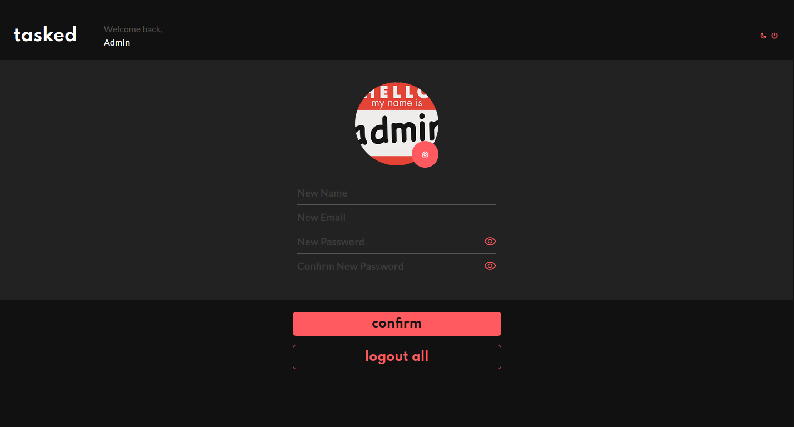

# Task-App

<p align="center">
  
</p>

<h2 align="center">
  A task app focus on simplicity. Built with ReactJS, Next.JS, Styled Components and Typescript.
</h2>

<p align="center">
  
  
  
  
  <a href="https://github.com/areasflavio/task-app/commits/master">
    
  </a>
</p>

<p align="center">
  <a href="#star-features">Features</a>&nbsp;&nbsp;|&nbsp;&nbsp;
  <a href="#keyboard-technologies">Technologies</a>&nbsp;&nbsp;|&nbsp;&nbsp;
  <a href="#computer_mouse-installation">Installation</a>
</p>





<br/>

# :star: Features

[(Back to top)](#Task-App)

This is a complete task app that focus on simplicity. You can create your account,
and start following your tasks.

Some key features are:

- Functional application with Next.JS and Server Side Rendering.
- Front-end state management done with Context API.
- Authentication system made with JWT.
- UI built with Styled Components.
- Mobile first.
- Light and Dark theme.
- Forms optimized and validated by React Hook Form and Yup.
- Custom alerts with React Hot Toast.
- Avatar upload for your user.
- Email service for welcome and goodbye messages.

The application is built using ReactJS with Next.JS framework and SSR feature.
Data is provided by a proprietary API, in this [repository](https://github.com/areasflavio/task-app-server).
The user interface is built with Styled Components and is mobile first. The entire
codebase is written using Typescript.

<p align="center">
  Checkout the <a href="https://areasflavio-task-app.herokuapp.com">API Live version</a>
   hosted on:
</p>
<p align="center">
    
</p>

<p align="center">
  You also can check the complete <a href="https://tasked.vercel.app">Application Live version</a>
  hosted on:
</p>
<p align="center">
    
</p>

<br/>

> The email service I used suspends the KEY if don't use it regularly, so if you
> don't get any emails it's because of that.

<br/>

# :keyboard: Technologies

[(Back to top)](#Task-App)

This is what I used and learned with this project:

- [x] ReactJS
- [x] Next.JS
- [x] Styled Components
- [x] JWT
- [x] Nookies
- [x] React Hook Form
- [x] Yup
- [x] React Hot Toast
- [x] Axios
- [x] Eslint
- [x] Typescript

<br/>

# :computer_mouse: Installation

[(Back to top)](#Task-App)

To use this project, first you need NodeJS and the API running in your device,
then you can follow the commands below:

```bash
# Clone this repository
git clone https://github.com/areasflavio/task-app.git

# Go into the repository
cd task-app

# Install dependencies for the application
yarn install

# Copy the .env.example to the .env file and inject your credentials
cp .env.example .env

# To start the development server, run the following command
yarn dev
```

# :man_technologist: Author

[(Back to top)](#Task-App)

Build by Flávio Arêas 👋 [Get in touch!](https://www.linkedin.com/in/areasflavio/)
